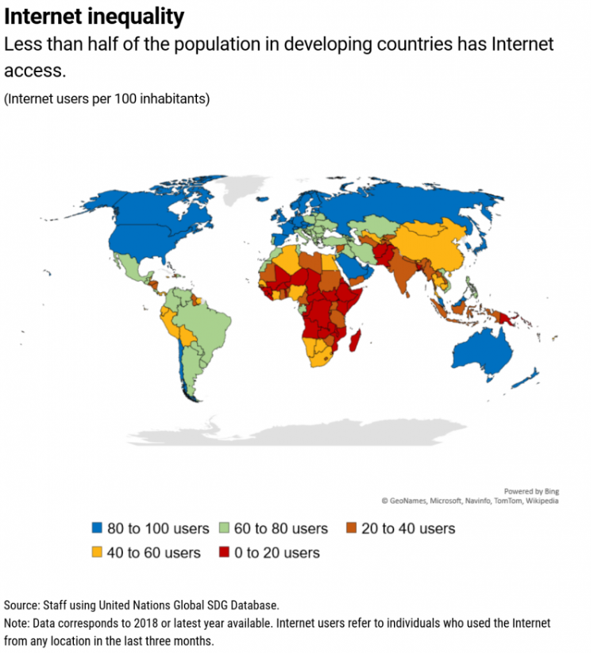
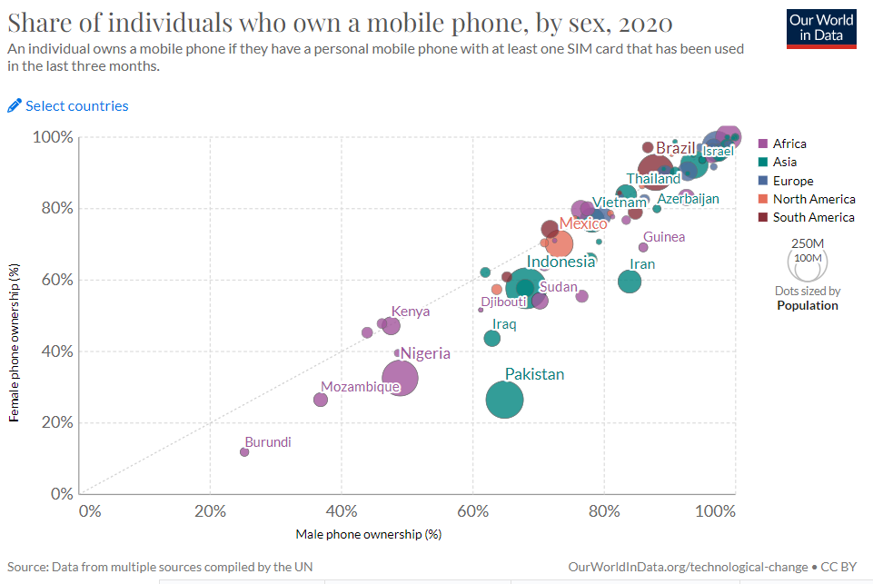
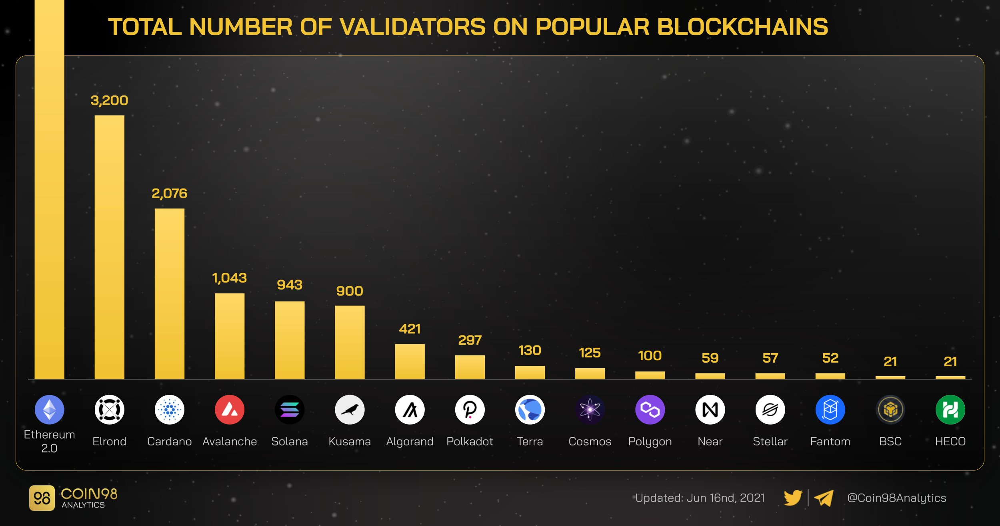

# Equity

The Gini coefficient is a widely used statistical measure for evaluating economic inequality in a society or a population. It calculates a value from zero to one- zero denoting perfect equality where everyone would get an equal proportion of the wealth and one denoting perfect inequality where one individual would hold all the wealth and the rest would possess nothing. In other words, Gini refers to the deviation from wealth distribution of a hypothetical perfectly equal society. A society that values and strives for equality amongst all individuals, irrespective of their race, gender, socioeconomic background, religion, language, age, and nationality- a gini score of zero would be a perfectly equal society.

The effect of cryptocurrency on the Gini coefficient, is an intriguing topic. With the decreased need for traditional financial intermediaries, some experts predict that cryptocurrencies have the potential to reduce the inequality gap by providing alternative financial opportunities to underserved populations. Cryptocurrencies hold incredible potential to shrink the inequality gap worldwide. By providing alternative financial opportunities that were previously unavailable to underserved populations, they can help foster economic growth and create greater financial stability. However, some believe that the highly volatile nature of cryptocurrencies could lead to increased risk in investment, as opposed to traditional forms of currency. This could potentially lead to greater levels of inequality as those who have more knowledge and experience with cryptocurrency investment could potentially profit more than those who do not. Nonetheless, the impact of cryptocurrency on financial inequality remains a highly debated topic.

Achieving a Gini score of zero in any society appears unlikely. When all actors are given absolute freedom, a considerable degree of inequality is expected since everyone is motivated differently in pursuing wealth and adopts strategies that push their personal interests. On the other hand, a society that aims for complete equality may suppress freedom, limiting individual behavior and efforts to earn rewards based on talent and diligence. Empowering individuals who seek to achieve a greater level of equity is a fundamental principle of web3. This means providing everyone with equal access and opportunities to embrace blockchain and crypto, regardless of their socioeconomic status, race, gender, or other attributes. By making web3 a platform for decentralization and democratization, we can create a more equitable future for all.

Taking all of the aforementioned points into consideration, we are in need of a well-crafted web3 system that allows sufficient room for builders to be recognized and rewarded for their valuable contributions. This is of utmost importance in order to not only foster, but also sustain incentives for intelligent and ambitious individuals to build and grow within the ecosystem. However, it also implies an added responsibility and tinge of pressure on builders and the ecosystem as a whole, to construct in a manner that provides ample opportunities for participants who may be less-advantaged.

Access to technology plays a crucial role in determining how equal and equitable a society can be and how much it is able to embrace web3. The availability and affordability of the internet and other technological tools are notable disparities between Africa, Europe, and the USA- discrepancies that also hold true for other parts of the world. Not being able to access the internet makes participation in web3 (and by association cryptocurrency) less accessible, limiting people's opportunities to engage with the global community. Creating more inclusive access is, therefore, a critical action to take towards reducing such inequalities. The provision of satellite internet at a affordable price can help increase access to internet.&#x20;

<figure><figcaption>
Inequality in the access to internet (1). 
</figcaption></figure>

Once access to the internet is established, individuals require hardware, such as a phone, to interact with it. Inexpensive and readily available, phones are one of the most popular devices used to access the internet. However, an individual's ability to have a phone may be influenced by various variables, such as their socioeconomic status, religion, or gender. For instance, individuals who are economically disadvantaged might be unable to afford the cost of a phone or reliable internet connection. Similarly, gender and religious biases may prevent individuals from having access to this technology.&#x20;

<figure><figcaption>
National gender differences in phone ownership (2).
</figcaption></figure>

Once a person has at least a phone and internet they can start participating in web3. No one gets excluded from Web3 because it is permissionless. As soon as an individual starts interacting with a piece of hardware like a phone, they are generating data. Data in the web2 model and individuals not claiming ownership of it or wanting to be paid for the use of it, has lead to massive corporations like Facebook and Google. In a web3 world, individuals would have ownership of this data and get paid for it, the minute they start interacting with the hardware.&#x20;

Another way to immediately start participating in an ecosystem is by running a blockchain validator. However, validators can also be a way in which inequality is perpetuated. Some of the most popular blockchains have less than a couple thousand validators. These validators get paid a percentage for transactions that occur on the blockchain they are validating. Without having everyone able to be a validator, socioeconomic inequality is perpetuated.&#x20;

<figure><figcaption>
Number of validators of popular blockchains (3).
</figcaption></figure>

Bitcoin is claimed to be one of the most decentralized blockchains, the one where the most validators can participate. However, in order to run a validator on this blockchain and be rewarded for it, a lot of computing power is needed. Along with that, 27% of Bitcoin that will ever be created is owned by the top 10,000 bitcoin investors (4).

Once connected to web3, gas fees need to be paid in order to do transactions on it. Ethereum, one of the most popular blockchains, has gas fees that exceed $2 for most transactions. $2 is on average what half of the world's population receives in a day of work. That means in order to do one transaction, you need to spend what you would earn in a day of work.&#x20;

In order for cryptocurrency to further global equity, systems need to be created that empower disenfranchised populations.  Some of the first starting principles for structuring these systems are don’t build a system that rewards benefits according to socioeconomic status (proof of stake systems where >$1 is needed in order to participate), don’t build a system that disproportionately favors firstcomers, and don’t build a system that demands extreme technological savvy to succeed (most blockchains).&#x20;

Sources

1: [https://www.imf.org/en/Blogs/Articles/2020/06/29/low-internet-access-driving-inequality](https://www.imf.org/en/Blogs/Articles/2020/06/29/low-internet-access-driving-inequality)

2: [https://ourworldindata.org/grapher/share-of-individuals-who-own-a-mobile-telephone-by-sex](https://ourworldindata.org/grapher/share-of-individuals-who-own-a-mobile-telephone-by-sex)

3: [https://twitter.com/Coin98Analytics/status/1430526409051492352](https://twitter.com/Coin98Analytics/status/1430526409051492352)

4: [https://www.cbsnews.com/news/bitcoin-cryptocurrency-wealth-one-percent/](https://www.cbsnews.com/news/bitcoin-cryptocurrency-wealth-one-percent/)
