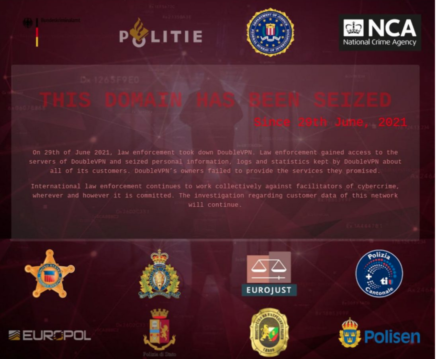

# Social Dynamics

Dunbar’s number

Dunbars number has since been broken down further into:

5 close friends

15 super family

50 clan

150 tribe

Legitimacy&#x20;

Legitimacy is a pattern that emerges naturally in many coordination games, and it informs each agent in a coordination’s mental model for what they can expect other agents to do.

The ways legitimacy is created or destroyed are:

Legitimacy by brute force

Legitimacy by continuity

Legitimacy by fairness

Legitimacy by process

Legitimacy by performance

Legitimacy by participation

Legitimacy by process

GreenPilled

.png>)

GreenPilled

